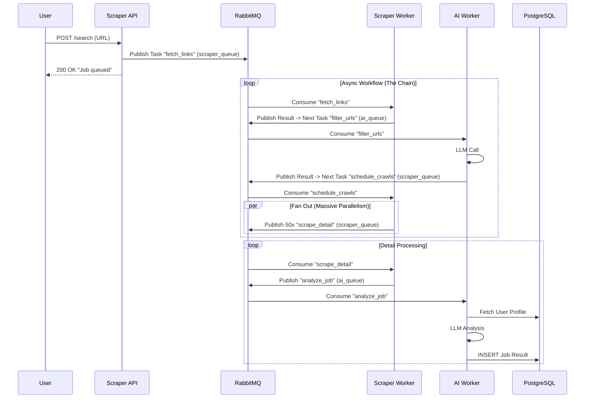

## 1. Overview

The system follows an **Event-Driven Microservices Architecture**.
It is designed for scalability, fault tolerance, and real-time observability. We utilize a **Hybrid Messaging Pattern**:

* **RabbitMQ** acts as the Message Broker for secure task transport (Persistence, Routing, ACKs).
* **Redis** acts as the Result Backend and cache for fast status retrieval.

The workflow relies on **Celery Chains** (Baton Pass pattern) to handle complex dependencies (Scraping -> Filtering -> Crawling -> Analysis) without blocking processes.

## 2. System Components

The system consists of 8 Docker containers:

| Container | Type | Technology | Function |
| --- | --- | --- | --- |
| **frontend** | UI | Next.js (React) | User interface for searching, viewing results, and managing profile settings. |
| **scraper-api** | API | FastAPI | Accepts search requests and initiates the Celery workflow. |
| **scraper-worker** | Worker | Celery (Python) | Handles IO-bound tasks (fetching links, downloading HTML). **Using Headless Browser (Playwright) & Proxy-ready**. |
| **ai-api** | API | FastAPI | Serves jobs and user settings from the DB to the frontend. |
| **ai-worker** | Worker | Celery (Python) | Handles CPU-bound tasks (LLM filtering & analysis). |
| **rabbitmq** | Broker | RabbitMQ | Manages queues (`scraper_queue`, `ai_queue`) and message routing. |
| **redis** | Backend | Redis | Temporarily stores task results for Celery. |
| **database** | DB | PostgreSQL | Stores persistent job data and user profiles. |

---

## 3. Data Flow (Workflow)

The core of the system is a **Celery Chain**. Tasks are not executed synchronously but are pushed as messages into RabbitMQ queues.

### Sequence Diagram

## 4. Database Schema (PostgreSQL)

### Table: `jobs`

Stores the found and analyzed job postings.

| Column | Type | Description |
| --- | --- | --- |
| `id` | VARCHAR (PK) | UUID v5 (generated from URL), prevents duplicates. |
| `title` | VARCHAR | Job title. |
| `company` | VARCHAR | Company name (Domain). |
| `description` | TEXT | Cleaned content as Markdown. |
| `match_score` | FLOAT | 0.0 to 100.0 (Personalized AI Rating). |
| `reasoning` | TEXT | AI reasoning for the score. |

### Table: `user_settings`

Stores the user's search profile for personalized analysis.

| Column | Type | Description |
| --- | --- | --- |
| `id` | INTEGER (PK) | Single-Row Design (ID=1). |
| `role` | VARCHAR | Target role (e.g., "Backend Dev"). |
| `skills` | VARCHAR | Tech Stack (e.g., "Python, AWS"). |
| `min_salary` | VARCHAR | Salary expectations. |
| `location` | VARCHAR | Location/Remote preference. |
| `preferences` | TEXT | Free text for dislikes or specific wishes. |

---

## 5. Scalability & Production Readiness

1. **RabbitMQ Reliability:**
* Messages are persistent. If a worker crashes, the task is not lost (Re-Queueing).
* Real-time monitoring via Management Dashboard (`http://localhost:15672`).

2. **Concurrency & Thread Safety:**
* **NullPool:** Workers use `NullPool` for database connections to guarantee fork-safety during multiprocessing.
* **Isolation:** Every task opens a fresh, isolated database connection.

3. **Horizontal Scaling:**
* Scraper and AI Workers are decoupled.
* Worker containers can be scaled up easily under load: `docker-compose up --scale ai-worker=5`.

4. **Observability & Logging:**
* **Structured Logging:** All services use a standardized `%(asctime)s - %(name)s - %(levelname)s - %(message)s` format.
* **Traceability:** Tasks log their unique IDs, URL targets, and execution status (Task Started -> LLM Call -> DB Save).
* **Debugging:** `scraper-worker` includes detailed Playwright logs for browser interactions (Launch -> Navigate -> Wait -> Extract).

---

## 6. Tech Stack

* **Frontend:** Next.js 14, Tailwind CSS, TypeScript.
* **Backend API:** FastAPI (Python 3.9).
* **Async Task Queue:** Celery 5.x.
* **Message Broker:** RabbitMQ 3 (Management Plugin enabled).
* **Result Backend:** Redis (Alpine).
* **Database:** PostgreSQL 15 (SQLAlchemy ORM).
* **AI:** OpenRouter API (OpenAI / DeepSeek Models).
* **HTML Parsing:** Playwright (Headless Browser) + BeautifulSoup4 + Markdownify.
