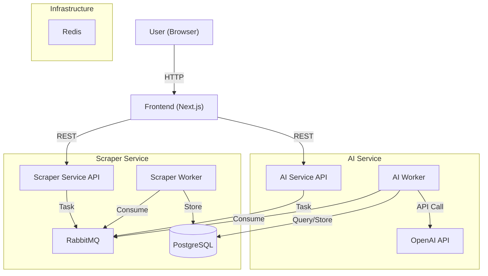

# AI Job Agent

The **AI Job Agent** is an intelligent application for automating the job search and application process. It combines web scraping, AI-powered analysis, and modern process management to help users efficiently find suitable job offers, evaluate them, and apply to them.


## 🚀 Features

*   **Automated Job Search (Scraping)**: Searches various job platforms for relevant job ads based on defined criteria.
*   **AI Analysis & Matching**: Analyzes job descriptions using LLMs (Large Language Models), compares them with the user profile, and calculates a matching score.
*   **Application Generation**: Automatically creates personalized cover letters and CV adaptations for specific positions.
*   **Application Process Management**: Track the status of your applications, save notes, and organize your job search in one place.
*   **Modern UI**: An appealing, user-friendly interface in Dark Mode with Glassmorphism effects for a pleasant user experience.

## 🏗️ Architecture & Technology Stack

The application is based on a modern microservices architecture, ensuring scalability and maintainability.

### Backend Services
*   **Scraper Service**: A FastAPI-based service responsible for crawling job boards. It uses `Playwright` for rendering dynamic websites and `Celery` for asynchronous task processing.
*   **AI Service**: A FastAPI service that provides the interface to OpenAI. It handles the analysis of job ads and text generation. `Celery` is also used here for background tasks.

### Frontend
*   **Tech Stack**: [Next.js 16](https://nextjs.org/), [React 19](https://react.dev/), [Tailwind CSS 4](https://tailwindcss.com/).
*   The frontend communicates with the backend services via REST APIs and offers a reactive user interface.

### Infrastructure & Data Storage
*   **PostgreSQL**: Relational database for storing jobs, applications, and user data.
*   **Redis**: In-memory data store, used as a message broker and result backend for Celery.
*   **RabbitMQ**: Message broker for robust communication between microservices.
*   **Docker & Docker Compose**: Containerization of all services for easy deployment and development.


```mermaid
graph TD
    User["User (Browser)"] -->|HTTP| Frontend["Frontend (Next.js)"]
    Frontend -->|REST| ScraperAPI["Scraper Service API"]
    Frontend -->|REST| AIAPI["AI Service API"]
    
    subgraph "Scraper Service"
        ScraperAPI -->|Task| RabbitMQ
        ScraperWorker["Scraper Worker"] -->|Consume| RabbitMQ
        ScraperWorker -->|Store| DB[("PostgreSQL")]
    end
    
    subgraph "AI Service"
        AIAPI -->|Task| RabbitMQ
        AIWorker["AI Worker"] -->|Consume| RabbitMQ
        AIWorker -->|Query/Store| DB
        AIWorker -->|API Call| OpenAI["OpenAI API"]
    end
    
    subgraph "Infrastructure"
        RabbitMQ
        Redis
        DB
    end
```

## 🛠️ Installation & Usage

### Prerequisites
*   [Docker](https://www.docker.com/) and [Docker Compose](https://docs.docker.com/compose/) must be installed.
*   An OpenAI API Key.

### Setup

1.  **Clone Repository**:
    ```bash
    git clone <repository-url>
    cd ai-job-agent
    ```

2.  **Configure Environment Variables**:
    Create a `.env` file in the main directory (see `.env.example`) and enter your OpenAI API Key:
    ```env
    OPENAI_API_KEY=sk-YourApiKey...
    POSTGRES_USER=user
    POSTGRES_PASSWORD=password
    POSTGRES_DB=jobdb
    ```

3.  **Start Application**:
    Start all services with Docker Compose:
    ```bash
    docker-compose up -d --build
    ```
    This builds the containers for Frontend, Scraper Service, and AI Service, and starts the database and message broker.

### Access
After starting, the services are available at the following addresses:

*   **Frontend**: [http://localhost:3000](http://localhost:3000)
*   **AI Service API Docs**: [http://localhost:8002/docs](http://localhost:8002/docs)
*   **Scraper Service API Docs**: [http://localhost:8001/docs](http://localhost:8001/docs)

### Usage

1.  Open the dashboard at `http://localhost:3000`.
2.  Navigate to "Job Search" and start a new crawl process for desired keywords and locations.
3.  The found jobs will appear in the overview. Click on a job to view details.
4.  Let the AI perform an analysis to see how well the job fits your profile.
5.  Generate a draft for your cover letter with one click.

## 🤝 Development

For local development, the services can also be started individually.

*   **Frontend**: `cd frontend && npm install && npm run dev`
*   **Backend**: Create a Python virtual environment, install requirements, and start services via Uvicorn.
*   However, it is recommended to use Docker for the infrastructure (DB, Redis, RabbitMQ).
